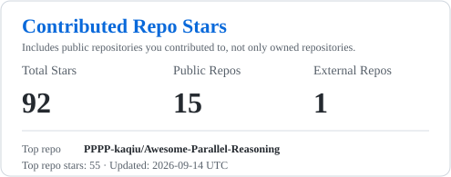

# Ziqi Wang (王梓齐)

  <a href="https://pppp-kaqiu.github.io/ppppkaqiu.github.io/"><b>Personal Website</b></a> |
  <a href="https://scholar.google.com/citations?user=kGYv10AAAAAJ"><b>Google Scholar</b></a> |
  <a href="https://www.xiaohongshu.com/user/profile/6203ee8a000000001000593e"><b>Rednote</b></a>

I am a final-year master's student at the **School of Artificial Intelligence and Data Science, University of Science and Technology of China (USTC)**, advised by **Prof. Tong Xu** and **Prof. Enhong Chen**.

I am currently a research intern at **通义千问**, where I focus on the infrastructure and algorithmic framework for **agents** and **agent reinforcement learning**. My work centers on building reliable, scalable systems that support the training, evaluation, and deployment of next-generation agentic models.

Previously, I worked on large language model reasoning and training systems at **Baidu ERNIE (Star)** and **StepFun**, gaining hands-on experience across pre-training, long-context modeling, post-training, and reasoning-oriented system design, along with large-scale distributed training at the scale of hundreds to over a thousand GPUs.

My research interests lie in **agents**, **reinforcement learning**, **reasoning**, and the **infrastructure** that connects these areas into practical and scalable intelligent systems. If you are interested in collaboration or discussion on these topics, feel free to contact me.

---

## Projects

- **Step2-mini & Step3: Cost-Effective Multimodal Intelligence** [[Website]](https://platform.stepfun.com/) [[Technical Report]](https://stepfun.ai/research/en/step3) [[arXiv]](https://arxiv.org/abs/2507.19427)  
  Contributed to the end-to-end development of state-of-the-art large language and multimodal reasoning models, scaling from tens to hundreds of billions of parameters with high efficiency.

- **Nano Agent Team** [[GitHub]](https://github.com/zczc/nano_agent_team)  
  Built an experimental multi-agent collaboration framework based on a file-system blackboard model, enabling autonomous planning, role coordination, and human-in-the-loop execution for complex tasks.

- **Awesome-Parallel-Reasoning** [[GitHub Repository]](https://github.com/PPPP-kaqiu/Awesome-Parallel-Reasoning)  
  Maintaining a curated repository that tracks the rapidly evolving landscape of parallel reasoning and multi-agent collaboration research, tools, and best practices in the LLM era.

---

## Education

- **M.S. in Artificial Intelligence and Data Science**, University of Science and Technology of China (2023 - Present)
- **B.S. in Artificial Intelligence and Data Science**, University of Science and Technology of China (2019 - 2023)

---

## Statistics

  
  

The right card is auto-updated daily and includes public repositories I contributed to, including external repositories.

<i>Built with simplicity in mind.</i>

